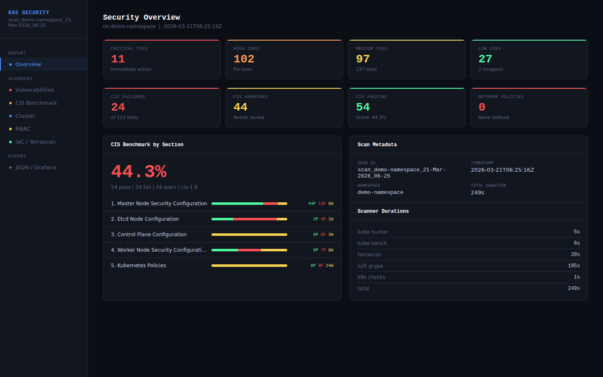
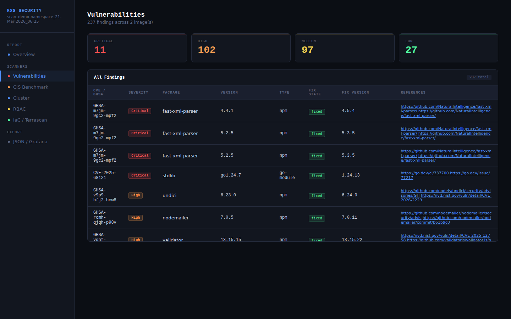
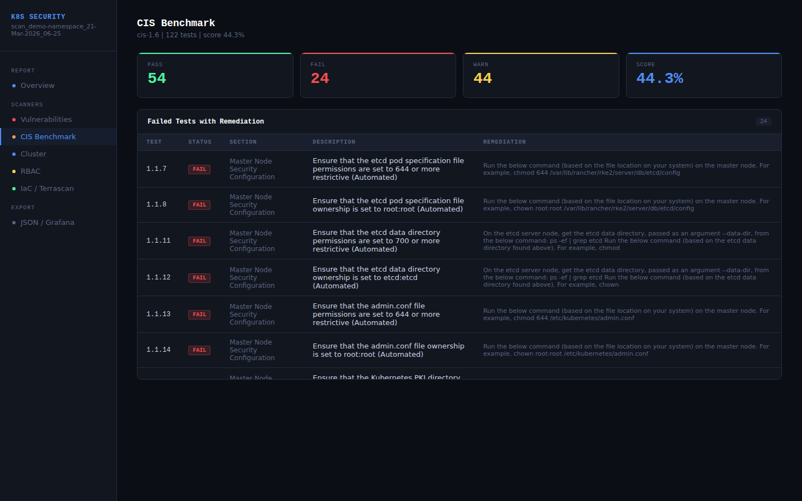
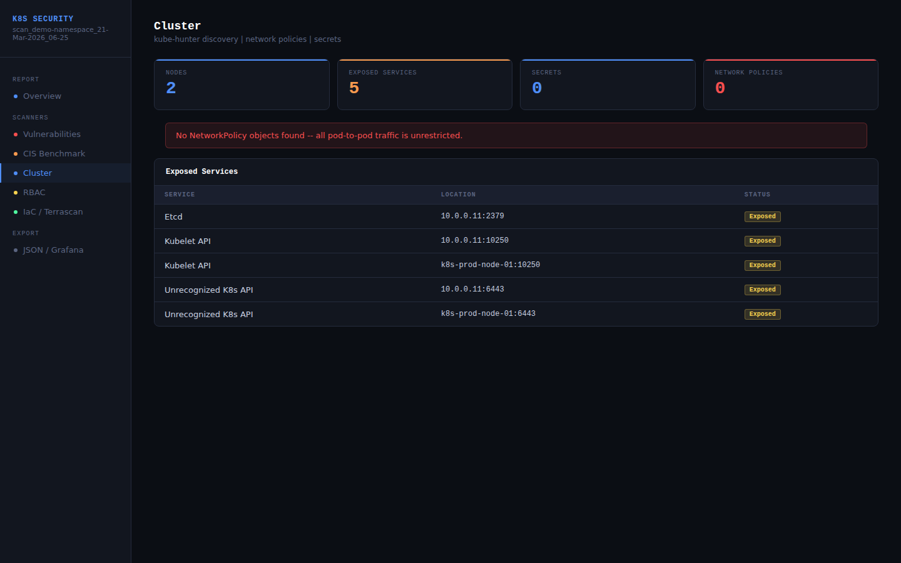
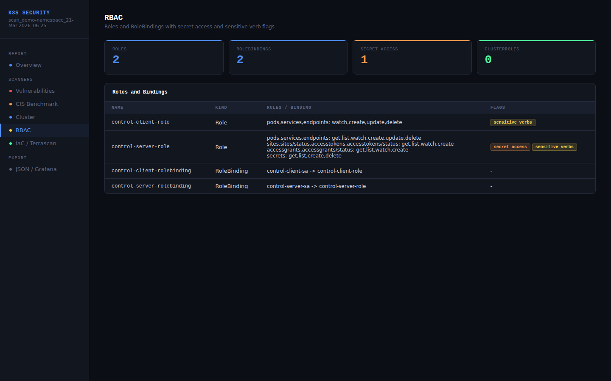
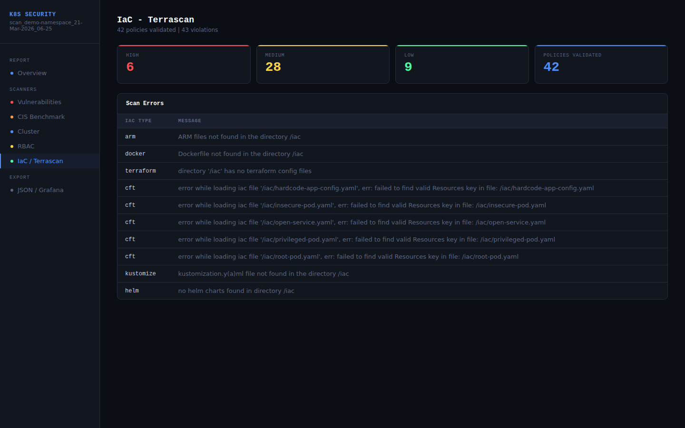

# K8s Security Scanner

A single-script Kubernetes security scanner that orchestrates five industry-standard open-source tools and produces a self-contained HTML report with an enriched `master-report.json` ready for Grafana or any dashboard.


---

## Overview

Running a full Kubernetes security assessment typically means installing and running multiple tools separately, manually correlating their outputs, and building your own report. This scanner does all of that in a single command.

It scans a namespace or the entire cluster, pulls results from five scanners in parallel where possible, and writes everything into one structured `master-report.json` plus a dark-themed interactive HTML report — with no external dependencies beyond Docker and kubectl.

---

## Screenshots

### Overview — executive summary, risk heatmap, top actions


### SBOM — vulnerabilities + license per image


### CIS Benchmark — grouped by node type with remediation


### Cluster Checks — network policies and secrets


### RBAC — role rules and subject chain


### YAML Vulnerability — color-coded violations


---

## What it scans

| Scanner | Tool | What it checks |
|---|---|---|
| SBOM + vulnerabilities | Syft + Grype | All container images — packages, CVEs, CVSS, EPSS, licenses |
| CIS benchmark | kube-bench | CIS Kubernetes Benchmark v1.6 — master, etcd, worker, policies |
| Network reconnaissance | kube-hunter | Exposed services, open ports, passive + optional active scan |
| YAML misconfigurations | Terrascan | Kubernetes manifests, Helm charts, Terraform, Dockerfiles |
| Cluster checks | kubectl | RBAC roles/bindings, NetworkPolicies, Secrets |

---

## HTML Report Sections

| Section | Description |
|---|---|
| **Overview** | Executive summary — top actions, risk heatmap, exposed services, CIS scores by node type |
| **SBOM** | Per-image vulnerability table with CVE, severity, CVSS, EPSS, package, license, fix version |
| **CIS Benchmark** | Findings grouped by node type (Master / Etcd / Worker / Policies) with actual vs expected values and remediation |
| **Cluster Checks** | NetworkPolicy table, Kubernetes secrets with Sensitive/Standard classification |
| **RBAC** | Role rule breakdown + subject → binding → role chain with risk flags |
| **YAML Vulnerability** | Terrascan violations color-coded by severity with file and resource references |
| **Network Exposure** | kube-hunter discovered nodes and services with risk ratings |
| **JSON / Grafana** | Download master-report.json + Grafana JSONPath query reference |

---

## Prerequisites

### Required on the host

| Tool | Purpose |
|---|---|
| `docker` | Runs all scanners as containers |
| `kubectl` | Cluster access and RBAC/secret/network checks |
| `python3` | Report generation |
| `jq` | JSON processing |

### Docker images pulled automatically

| Image | Scanner |
|---|---|
| `aquasec/kube-hunter:latest` | Network reconnaissance |
| `aquasec/kube-bench:latest` | CIS benchmark |
| `tenable/terrascan:latest` | YAML/IaC misconfiguration |
| `anchore/syft:latest` | SBOM generation |
| `anchore/grype:latest` | Vulnerability matching |

All scanner images are pulled on first run. No installation needed beyond Docker.

### Cluster access

You need `kubectl` configured with access to the target cluster. The script supports:
- Existing kubeconfig (`~/.kube/config` or `$KUBECONFIG`)
- API server URL + Bearer token

Minimum RBAC permissions required:

```yaml
rules:
  - apiGroups: [""]
    resources: ["pods", "secrets", "namespaces", "networkpolicies", "nodes"]
    verbs: ["get", "list"]
  - apiGroups: ["rbac.authorization.k8s.io"]
    resources: ["roles", "rolebindings", "clusterroles", "clusterrolebindings"]
    verbs: ["get", "list"]
```

---

## Installation

```bash
git clone https://github.com/abluva-research/secure-agent-net.git
cd k8scanner
chmod +x k8scanner.sh
```

No pip installs, no npm, no virtual environments. Just bash + Docker.

---

## Usage

```bash
./k8s-security-scanner.sh
```

The script is fully interactive and prompts for all options:

| Prompt | Default | Description |
|---|---|---|
| Output directory | `./scans` | Where scan output folders are created |
| Namespace | `all` | Kubernetes namespace to scan, or `all` for cluster-wide |
| YAML / IaC path | current dir | Directory containing manifests, Helm charts, or Terraform files |
| Directory naming | default | Auto-named `scan_<ns>_DD-Mon-YYYY_HH-MM` or custom name |
| Active scan | No | Enable kube-hunter active attack simulation (staging only) |
| Generate report | Yes | Build master-report.json and HTML report |
| Auth method | kubeconfig | Use existing kubeconfig or API server + token |

### Example session

```
Output dir (default ./scans): /home/user/scans
Namespace to scan (default: all): my-namespace
Enter path (default: current dir): /home/user/manifests
Select [1]: 2
Enter scan name: my-scan
Enable kube-hunter ACTIVE scan? (y/N): N
Generate master report + HTML? (Y/n): Y
Auth method: 1

[+] Cluster access confirmed
[i] Scan ID   : scan-my-scan-21-Mar-2026_10-30
[i] Namespace : my-namespace
[i] Output    : /home/user/scans/scan-my-scan-21-Mar-2026_10-30

[+] Running kube-hunter...
[i] Passive scan done
[+] Running kube-bench (CIS benchmark)...
[i] kube-bench done
[+] Running terrascan (IaC)...
[i] terrascan done
[+] Running SBOM + vulnerability scan...
[i]   Found 6 images — scanning up to 4 in parallel
[1/6] Syft: registry.example.com/my-api:v1.0
[2/6] Syft: registry.example.com/my-client:v1.0
[1/6] Grype: registry.example.com/my-api:v1.0
[+] Running RBAC / Secrets / Network checks...
[+] Building enriched master report...

[+] ==============================================
[+] Scan complete in 00:04:09
[+]
[+]   Total time   : 00:04:09
[+]   kube-hunter  : 00:00:05
[+]   kube-bench   : 00:00:06
[+]   terrascan    : 00:00:20
[+]   syft + grype : 00:03:15
[+]   k8s checks   : 00:00:01
[+]
[+]   Output: /home/user/scans/scan-my-scan-21-Mar-2026_10-30
[+]   scan-my-scan-21-Mar-2026_10-30.html  - HTML report
[+]   master-report.json                       - enriched JSON
[+] ==============================================
```

---

## Output Structure

```
scan-my-scan-21-Mar-2026_10-30/
├── scan-my-scan-21-Mar-2026_10-30.html   ← self-contained HTML report
├── master-report.json                        ← enriched JSON for Grafana/dashboards
├── scan-results/                             ← raw scanner outputs
│   ├── kube-hunter-passive.json
│   ├── kube-hunter-active.json
│   ├── kube-bench.json
│   ├── terrascan.json
│   ├── rbac.json
│   ├── secrets.json
│   └── network.json
├── sbom/                                     ← per-image SBOM + vulnerability files
│   ├── sbom-<image>.json
│   └── sbom-vuln-<image>.json
└── logs/                                     ← scanner stderr for debugging
    ├── syft-<image>.log
    ├── grype-<image>.log
    └── terrascan.log
```

The HTML report and `master-report.json` are named identically to the output directory so multiple scan results are easy to match when archived.

---

## master-report.json Schema

```json
{
  "meta": {
    "scan_id": "scan-my-scan-21-Mar-2026_10-30",
    "timestamp": "2026-03-21T10:30:00Z",
    "namespace": "my-namespace",
    "scanner_versions": { "kube_hunter": "...", "syft": "...", "grype": "..." },
    "scanner_durations": {
      "kube_hunter_seconds": 5,
      "kube_bench_seconds": 6,
      "terrascan_seconds": 20,
      "syft_grype_seconds": 195,
      "k8s_checks_seconds": 1,
      "total_seconds": 249
    }
  },
  "summary": {
    "vulnerabilities": { "critical": 4, "high": 58, "medium": 33, "low": 12, "total": 107, "images_scanned": 2 },
    "cis_benchmark":   { "pass": 54, "fail": 24, "warn": 44, "total": 122, "score_pct": 44.0, "cis_version": "cis-1.6" },
    "cluster":         { "nodes": 2, "exposed_services": 5, "network_policies": 0, "no_network_policy": true, "secrets_total": 0, "rbac_roles": 2, "rbac_secret_access": 1 },
    "iac":             { "policies_validated": 42, "violated_policies": 43, "high": 6, "medium": 28, "low": 9 },
    "packages":        { "total": 855 }
  },
  "scanners": {
    "kube_hunter_passive": { "nodes": [], "services": [], "vulnerabilities": [] },
    "kube_bench": {
      "sections": [{
        "id": "1", "title": "Master Node Security Configuration", "node_type": "master",
        "pass": 44, "fail": 13, "warn": 8,
        "findings": [{
          "test_number": "1.1.1",
          "description": "Ensure API server pod specification file permissions are 644 or more restrictive",
          "status": "FAIL",
          "remediation": "chmod 644 /path/to/kube-apiserver.yaml",
          "actual_value": "permissions=777",
          "expected_result": "permissions=644",
          "audit": "/bin/sh -c 'stat -c permissions=%a /path/to/kube-apiserver.yaml'",
          "scored": true
        }]
      }]
    },
    "terrascan": {
      "violations": [{ "rule_name": "runAsNonRootCheck", "severity": "HIGH", "resource_name": "example-pod", "file": "example-pod.yaml", "description": "Minimize admission of root containers", "category": "Identity and Access Management" }]
    },
    "syft_grype": {
      "images": [{
        "image": "registry.example.com/my-api:v1.0",
        "package_count": 855,
        "package_types": { "npm": 758, "go-module": 68, "apk": 28 },
        "packages": [{ "name": "web-framework", "version": "4.0.0", "type": "npm", "licenses": ["MIT"] }],
        "vulnerabilities": [{ "id": "GHSA-xxxx-xxxx-xxxx", "severity": "Critical", "cvss_score": 9.3, "package": "some-package", "version": "1.0.0", "fix_available": true, "fix_versions": ["1.0.1"] }]
      }]
    },
    "rbac": {
      "roles": [{ "name": "app-role", "namespace": "my-namespace", "rules": [{ "resources": ["secrets"], "verbs": ["get", "list", "delete"] }], "secret_access": true, "sensitive_verbs": true }],
      "role_bindings": [{ "name": "app-rolebinding", "subjects": [{ "kind": "ServiceAccount", "name": "app-serviceaccount" }], "role_ref": { "name": "app-role" } }]
    },
    "network_policies": { "policies": [], "summary": { "total_policies": 0, "no_policies_warn": true } },
    "secrets": { "secrets": [], "summary": { "total": 0, "by_type": {} } }
  }
}
```

---

## Grafana Integration

Point a Grafana JSON datasource at `master-report.json` and use these JSONPath queries:

| Panel | JSONPath |
|---|---|
| Critical CVEs | `$.summary.vulnerabilities.critical` |
| CIS compliance score | `$.summary.cis_benchmark.score_pct` |
| CIS failures | `$.summary.cis_benchmark.fail` |
| No NetworkPolicy alert | `$.summary.cluster.no_network_policy` |
| All CVEs | `$.scanners.syft_grype.images[*].vulnerabilities[*]` |
| Critical + High CVEs | `$.scanners.syft_grype.images[*].vulnerabilities[?(@.severity=="Critical" or @.severity=="High")]` |
| CIS FAIL findings | `$.scanners.kube_bench.sections[*].findings[?(@.status=="FAIL")]` |
| Roles with secret access | `$.scanners.rbac.roles[?(@.secret_access==true)]` |

---

## Private Registry Support

For images in private or insecure (HTTP) registries:

- If `~/.docker/config.json` exists it is automatically mounted into the Syft container for authentication
- Plain HTTP registries are supported via `SYFT_REGISTRY_INSECURE_USE_HTTP=true`
- Self-signed TLS registries are supported via `SYFT_REGISTRY_INSECURE_SKIP_TLS_VERIFY=true`

No extra configuration needed — the script detects and handles both cases automatically.

---

## Active Scanning Warning

kube-hunter's active scan mode performs real attack simulations against your cluster. It can trigger IDS/IPS alerts, cause unexpected behaviour in my-namespace workloads, and be mistaken for a real attack by monitoring systems.

**Only enable active scanning in staging environments or with explicit written approval.**

The script displays a full warning and requires `y` confirmation before enabling active mode.

---

## Performance

| Cluster size | Approx scan time |
|---|---|
| 1–5 images, 1 namespace | 3–8 min |
| 5–15 images, 1 namespace | 8–20 min |
| 15–30 images, all namespaces | 20–45 min |
| 30+ images, all namespaces | 45+ min |

The bottleneck is always syft+grype. Each image takes 1–3 minutes depending on size. The parallel limit defaults to 4 concurrent image scans — increase it by changing `local PARALLEL=4` inside `run_syft_grype()` if your machine has sufficient CPU and RAM (recommended: 2GB RAM per concurrent scan).

---

## Known Limitations

- **kube-bench on managed clusters** — kube-bench runs inside Docker and may not detect the Kubernetes distribution on some managed clusters (EKS, GKE, AKS). Results marked FAIL due to tool errors rather than actual misconfiguration will include a `reason` field explaining the failure.
- **macOS** — requires bash 4+ (`brew install bash`). macOS ships with bash 3.2 which does not support associative arrays (`declare -A`).
- **Windows** — not supported natively. Use WSL2 with Docker Desktop.
- **Terrascan CFT errors** — CloudFormation templates require explicit `cfngo` support and may show scan errors when used with standard Kubernetes YAML directories. These are non-fatal and do not affect Kubernetes manifest scanning.

---

## Security Notice

This tool is intended for authorised personnel scanning clusters they own or have explicit permission to assess. Scanning clusters without authorisation may violate computer fraud laws in your jurisdiction.

The script does not transmit any data outside your network. All scanning runs locally via Docker and kubectl.

---

## Tools Used

| Tool | Author | License | GitHub |
|---|---|---|---|
| kube-hunter | Aqua Security | Apache-2.0 | [aquasecurity/kube-hunter](https://github.com/aquasecurity/kube-hunter) |
| kube-bench | Aqua Security | Apache-2.0 | [aquasecurity/kube-bench](https://github.com/aquasecurity/kube-bench) |
| Syft | Anchore | Apache-2.0 | [anchore/syft](https://github.com/anchore/syft) |
| Grype | Anchore | Apache-2.0 | [anchore/grype](https://github.com/anchore/grype) |
| Terrascan | Tenable | Apache-2.0 | [tenable/terrascan](https://github.com/tenable/terrascan) |

---

## Contributing

Pull requests are welcome. For significant changes please open an issue first to discuss what you would like to change.

When contributing:
- Test against both namespace-scoped and full cluster (`all`) scans
- Run `bash -n k8s-security-scanner.sh` to check for syntax errors before submitting
- Ensure Python heredoc report builder has no f-string brace escaping issues

---

## License

Apache 2.0 — see [LICENSE](LICENSE) for details.
